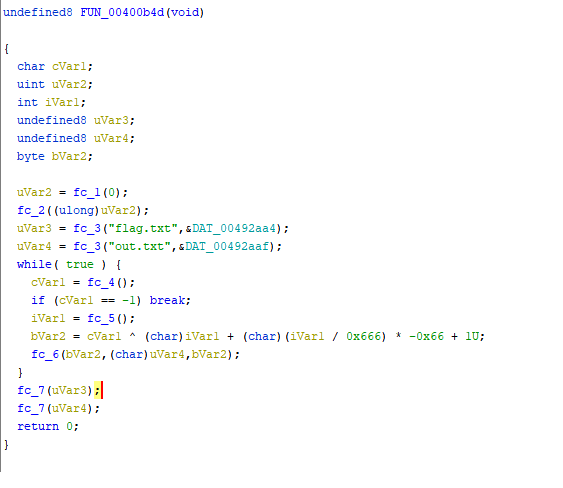
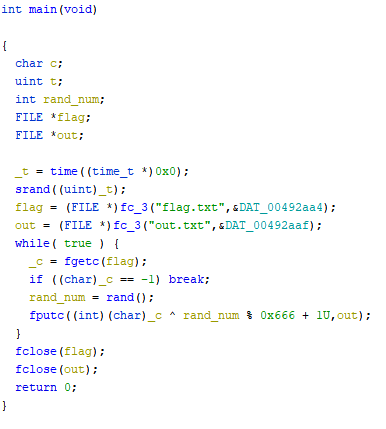

# Nameless - Solution

Created by Yarin ([GitHub](https://github.com/CmdEngineer) / [Twitter](https://twitter.com/CmdEngineer_)) and Idan ([GitHub](https://github.com/idan22moral/) / [Twitter](https://twitter.com/idan_moral))

Writeup written by moka ([Discord](https://discordapp.com/users/661109271148101652))

## Description
> Strip my statically linked clothes off


## Solution
the given executable is statically linked and stripped which means reversing will be a bit tougher.\
fortunately main isn't too complicated and so we'll be able to guess what functions are used.

the initial ghidra decompilation will look something like this:\

\

Unique disassembled functions from top to bottom:
1. syscall with eax=0xc9 (time syscall) - time.
2. uses the time as a parameter - srand.
3. takes filename as first parameter - fopen.
4. takes FILE* as input, return value is compared with EOF (-1) - fgetc.
5. does not accept parameters return value is used, uses shared global variables with srand - rand.
6. number of parameters is off, the function uses output's FILE* and a manipulated value - fputc.\
7. FILE* parameter, return value unused - fclose

after renaming and retyping:\


now the actions of the binary are much more clear.\
it seeds with time(0), reads characters from the flag one by one\
and then xors them with a random value between 1 and 666.

since the challenge is given to us inside a .rar - \
we can use the modification time of out.txt to guess the time that was passed to srand.

```
$ stat -c %Y out.txt
1586541672
```

1586541672 is the timestamp we can use to start guessing with.

this small script I wrote tries to bruteforce the seed by comparing the first bytes of output with hexCTF\
for every seed going down from the modification time.
```c
int main()
{
	FILE *out = fopen("out.txt", "r");
    char buff[35] = {0}, test[35] = {0};
	fread(buff, 1, 34, out);
	unsigned int t = 1586541672;
	
	do
	{
		srand(t--);
		for(char i = 0; i < 6; i++)
			test[i] = buff[i] ^ rand() % 0x666 + 1;
	} while(strcmp(test, "hexCTF"));

	srand(t + 1);
	for(char i = 0; i < 34; i++)
		test[i] = buff[i] ^ rand() % 0x666 + 1;

	printf("%s\n", test);

    fclose(out);
}
```

Flag: `hexCTF{nam3s_ar3_h4rd_t0_r3m3mb3r}`