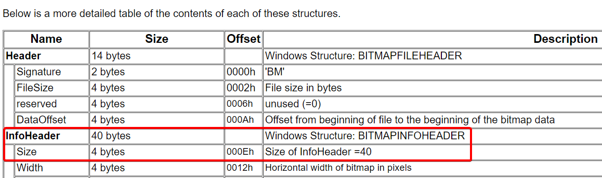

# PIL - Solution

Created by Idan ([GitHub](https://github.com/idan22moral/) / [Twitter](https://twitter.com/idan_moral))

## Description
> Our team detected a suspicious image, and managed to get a code of some sort.  
We think they are related.  
Can you investigate this subject and see if you can give us more data?

## Solution

We get a `bmp` image, and a source file of some sort.  
By reading the first lines of the source we can see that we're working with something related to C#.
```
...
    .class private auto ansi beforefieldinit csharp.Program
...
```

By investivating and googling about it, we can understand that we're working with .NET IL (Intermediate Language) code (aka CIL, MSIL). It is also written anywhere in the code if you haven't seen it.

If you haven't seen yet - IL code is hard and not fun to read.  
So we have to approaches here:
1. Try to convert the IL code to C# 
2. Try to reverse using the IL (hardcore)

### Approach 1:
1. Use Windows' builtin called [ilasm](ilasm_lnk) to compile the IL code to an executable.
2. Use any C# decompiler ([JustDecompile](jd_lnk), [ILSpy](ilspy_lnk), etc.) to decompile the code and get the source in a more readble way.

### Approach 2:
I'll explain this approach deeper, since this is the hardcore and fun way.  
At the beginning of the code we can see the definitions of the main function, and we can see some static strings, such as `"one-million-digits.txt"`, `"original.bmp"`, `"result.bmp"` and `"<CENSORED>"` (which is the flag, but censored).

From that we can understand that the original file was modified in some way, and we got the result image, which leads us to thinking that we're working on a steganography challenge of some sort.

we can also see a function called `Hide` which is a big hint.  
Let's try to understand how `Hide` works, so we can reverse it and get the flag.

We see that the function gets a secret (flag), source and destination paths (probably for the original and result files), and that there are some local variables defined. One of the is BitArray (steganography + bits = [LSB Steganography](lsb_lnk)? Maybe, lets see)
```cs
.method private hidebysig static 
        void Hide (
            string srcPath,
            string dstPath,
            string secret
        ) cil managed 
    {
        // Method begins at RVA 0x2078
        // Code size 106 (0x6a)
        .maxstack 5
        .locals init (
            [0] class [mscorlib]System.Collections.BitArray,
            [1] uint8[],
            [2] int32,
            [3] int32,
            [4] uint8,
            [5] int32
        )
        ...
```

A quick jump to the end of the file to make thing easier to explain:  
We can see that there's a function called `GetNextPiDigit`. We assume that we can rely on the developer sense, and we can say that the function should return the next digit of Pi from the `"one-million-digits.txt"` file that we saw mentioned earlier (Oh! PIL = PI + IL!).  
Btw - when talking about the digits of Pi we often do not include the `3.` part, but if we're not sure we can try both options.
```cs
.method private hidebysig static
        int32 GetNextPiDigit () cil managed 
    {
        ...

        IL_0000: ldsfld class [mscorlib]System.IO.FileStream csharp.Program::piFile
        IL_0005: callvirt instance int32 [mscorlib]System.IO.Stream::ReadByte()
        ...
        IL_0010: ldsfld class [mscorlib]System.IO.FileStream csharp.Program::piFile
        IL_0015: callvirt instance int32 [mscorlib]System.IO.Stream::ReadByte()
        ...
    } // end of method Program::GetNextPiDigit
```

Back to the `Hide` function:  
Now we know that we're looking for something related to Pi, and data hiding.  
When opening the `bmp` that we got - it works, so the header must be valid and not corrupted.  
Let's take a look at the [BMP specification](bmp_lnk):

The size of the header is 0xe (14) and we see this value in the code here:  
```cs
IL_0012: call uint8[] [mscorlib]System.IO.File::ReadAllBytes(string)
IL_0017: stloc.1
IL_0018: ldloc.1
IL_0019: ldc.i4.s 14
IL_001b: ldelem.u1
IL_001c: ldc.i4.s 14
IL_001e: add
IL_001f: stloc.2
```
By schematically looking at the code, or by referring to the documentation of IL, we can understand that this code simply does:
```cs
int dataOffset = bmpContent[14] + 14; // the offset in which the BMP data begins
```
After this part of the code we get see the beginning of a loop, in which there's a call to `GetNextPiDigit`, and some binary operations are made:
```cs
IL_0023: br.s IL_0058
    // loop start (head: IL_0058)
        IL_0025: ldloc.2
        IL_0026: call int32 csharp.Program::GetNextPiDigit()
        IL_002b: add
        IL_002c: stloc.3
        IL_002d: ldc.i4 254
        IL_0032: ldloc.1
        IL_0033: ldloc.3
        IL_0034: ldelem.u1
        IL_0035: and
        IL_0036: conv.u1
        IL_0037: stloc.s 4
```
We can try to convert it to some pseudocode in C#
```cs
int someOffset = dataOffset + GetNextPiDigit();
char bmpByte = bmpContent[someOffset];
char hiddenByte = (char)(254 & bmpByte); // 0b11111110 & bmpByte
```
Next we see this:
```cs
IL_0039: ldloc.1
IL_003a: ldloc.3
IL_003b: ldloc.s 4
IL_003d: ldloc.0
IL_003e: ldloc.s 5
IL_0040: callvirt instance bool [mscorlib]System.Collections.BitArray::get_Item(int32)
IL_0045: call uint8 [mscorlib]System.Convert::ToByte(bool)
IL_004a: add
IL_004b: conv.u1
IL_004c: stelem.i1
IL_004d: ldloc.2
IL_004e: ldc.i4.s 10
IL_0050: add
IL_0051: stloc.2
IL_0052: ldloc.s 5
IL_0054: ldc.i4.1
IL_0055: add
IL_0056: stloc.s 5
```
It looks like we take one bit from the `BitArray` object, we convert it to byte using `ToByte` function, then we sum it with the hiddenByte from earlier. After that we store the result in the exact same place it was taken from. Last thing - `dataOffset` is increased by 10.  
So:
```cs
bmpContent[someOffset] = (char)(hiddenByte + Convert.ToByte(BitArray[i]));
dataOffset += 10;
```
The only thing left is the writing to the output file:
```cs
IL_0062: ldarg.1
IL_0063: ldloc.1
IL_0064: call void [mscorlib]System.IO.File::WriteAllBytes(string, uint8[])
IL_0069: ret
```

After some renaming and changes we can say that this is the source code of hide:
```cs
static void Hide(string srcPath, string dstPath, string secret)
{
    byte[] secretBytes = System.Text.Encoding.UTF8.GetBytes(secret);
    BitArray secretBits = new BitArray(secretBytes);
    byte[] bmpContent = File.ReadAllBytes(srcPath);
    int dataOffset = bmpContent[14] + 14;
    int hideOffset;
    byte maskedByte;

    for (int i = 0; i < secretBits.Length; i++)
    {
        hideOffset = dataOffset + GetNextPiDigit();
        maskedByte = (byte)(0b11111110 & bmpContent[hideOffset]);
        bmpContent[hideOffset] = (byte)(maskedByte + Convert.ToByte(secretBits[i]));
        dataOffset += 10;
    }
    File.WriteAllBytes(dstPath, bmpContent);
}
```
So it is a LSB Steganography hider, but with a twist of using Pi's digits to select where to hide a bit in every 10 bytes.

Let's create a reverse function (we'll need to download a file with 1M digits of Pi too, but it's easy):
```cs
static void Main(string[] args)
{
    piFile = new FileStream("one-million-digits.txt", FileMode.Open, FileAccess.Read);
    Reveal("result.bmp", "decoded.bmp");
    piFile.Close();
}

static void Reveal(string srcPath, string dstPath)
{
    byte[] srcBytes = File.ReadAllBytes(srcPath);
    byte[] dstBytes = new byte[100];
    int dataOffset = srcBytes[14] + 14;
    int hideOffset;
    int bit;

    // I'm using the number 800 because I assume that the flag is shorter than 100 chars
    for (int bitCount = 0; bitCount < 800; bitCount++)
    {
            hideOffset = dataOffset + GetNextPiDigit();
            bit = srcBytes[hideOffset] % 2;
            dstBytes[bitCount / 8] += (byte)(bit << (bitCount % 8));
            dataOffset += 10;
    }

    File.WriteAllBytes(dstPath, dstBytes);
}

static int GetNextPiDigit()
{
    int digit = piFile.ReadByte();
    return digit - '0';
}
```

After running the program, we get a file, and it's content is:
```
hexCTF{l00k_wh0_l3arned_t0_sp34k_byt3c0de}F..c..u.Ѡ..Y..P.,8/S....&...G...)..<7..V....I,BY..4>
```
<br>

Flag: `hexCTF{l00k_wh0_l3arned_t0_sp34k_byt3c0de}`


[ilasm_lnk]: https://docs.microsoft.com/en-us/dotnet/framework/tools/ilasm-exe-il-assembler
[jd_lnk]: https://www.telerik.com/products/decompiler.aspx
[ilspy_lnk]: https://github.com/icsharpcode/ILSpy
[lsb_lnk]: https://itnext.io/steganography-101-lsb-introduction-with-python-4c4803e08041
[bmp_lnk]: http://www.ece.ualberta.ca/~elliott/ee552/studentAppNotes/2003_w/misc/bmp_file_format/bmp_file_format.htm