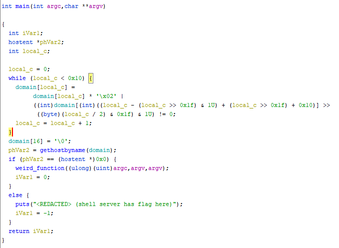

# WannaSmile - Solution

Created by moka ([Discord](https://discordapp.com/users/661109271148101652))

## Description
> I accidentally executed this weird file that encrypted my important files!\
please help me understand what it does
<br>
`ssh wannasmile@challenges1.hexionteam.com -p 4000`<br/>
Password: `hexctf`
<br><br>
*This challenge consists of 2 parts.<br>
**Attached version has the first flag removed.

## Solution
we get a binary called wannasmile (seems familiar)\
and we need to understand how it works,\
and for that we can start by disassembling it. (I'll use Ghidra)

after some renaming, main should look somewhat like this:
<br>

<br>
it looks like a certain string is being decoded and then
fed to gethostbyname,\
and if that host can be resolved by the system - the first flag is printed!

instead of trying to understand the unreadable decompilation,\
we could use dynamic analysis tools like gdb/ltrace/strace to see the\
decoded string in runtime.
<br>

<br>

this hostname does not resolve to anything,\
and we can't edit /etc/hosts on the remote machine,\
but the binary on the remote does not have it's SUID bit enabled\
which means we can use environment variables like LD_PRELOAD and more conveniently - HOSTALIASES.

`"The HOSTALIASES environment variable allows users to set their own host aliases instead of having to sudoedit /etc/hosts"` (from stackoverflow)\
this means we can set HOSTALIASES to our own hosts file that aliases `uaresuchacrybaby`\
to a different name that resolves successfully.

Solution Example:\
```
echo "uaresuchacrybaby www.google.com" > /tmp/myhosts
HOSTALIASES=/tmp/myhosts ./wannasmile
```

Flag: `hexCTF{1m_s0rry_1f_y0u_r3v3r5ed_7h1s}`
